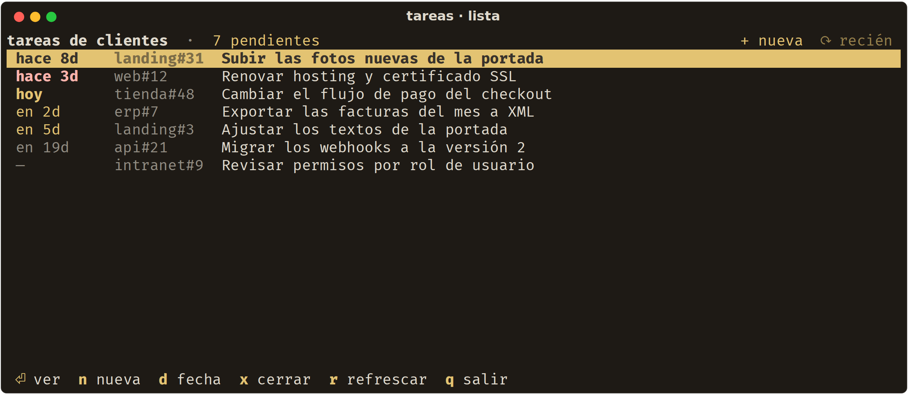
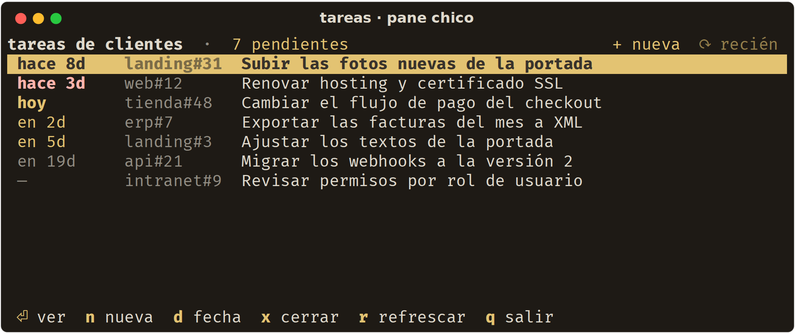
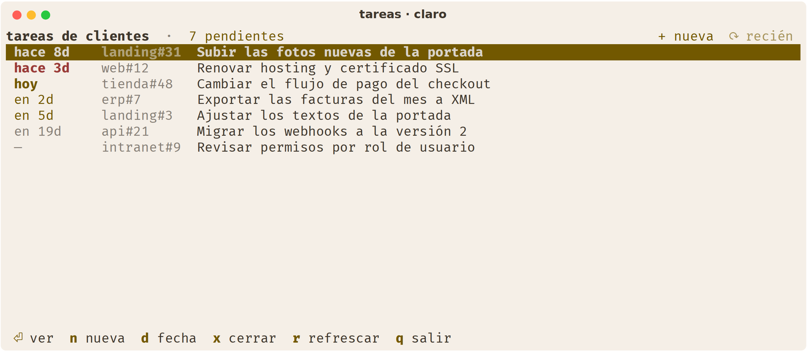
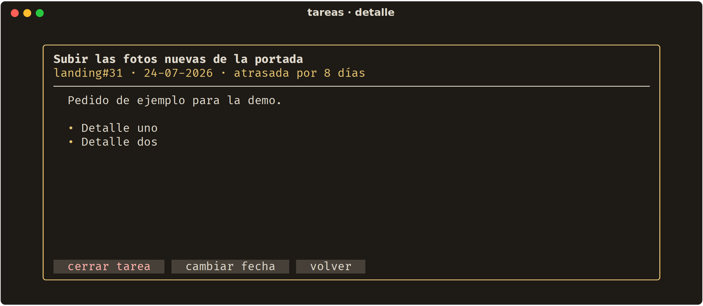
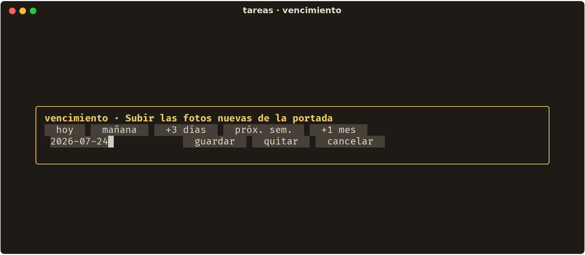
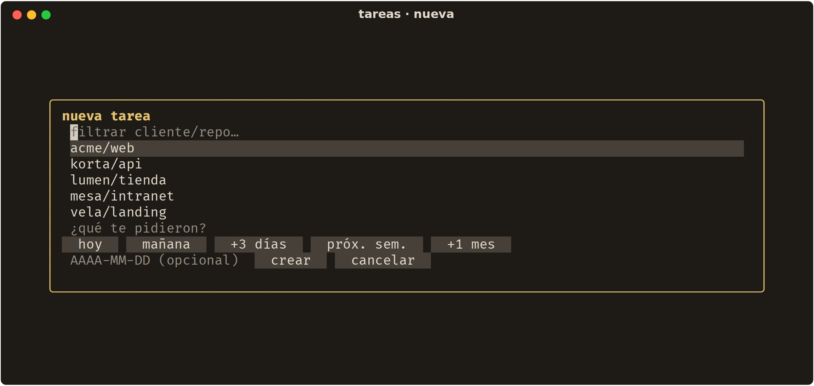
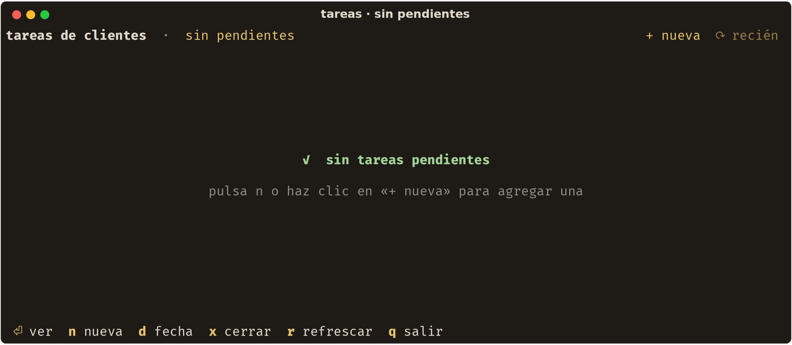

# tareas

TUI para llevar las tareas de clientes sobre un **GitHub Project (v2)**, pensada para
quedarse abierta todo el día en un pane chico y no estorbar.



Una tarea es un issue de GitHub dentro de un Project. Esta app es la vista rápida de
ese Project: qué está pendiente, qué vence primero y qué ya se puede cerrar — sin
abrir el navegador.

## Por qué existe

Los tableros de GitHub son cómodos en pantalla completa y terribles en un pane de
terminal. Esto es lo contrario:

- **Cabe en un pane chico.** El caso de diseño es 80×15. Una línea por tarea, una
  línea de cabecera, una de atajos, y nada más.
- **Se opera con el mouse.** Cada acción tiene un blanco clickeable: las filas, los
  botones de la cabecera, los atajos del pie y los botones de cada diálogo. El teclado
  es un atajo, no un requisito.
- **Se adapta sola.** Al agrandar o achicar el pane recalcula los anchos y trunca los
  títulos con puntos suspensivos; nada se desborda ni queda cortado a la mitad.
- **Usa los colores de tu terminal.** No trae paleta propia: hereda la tuya, así que si
  tu terminal conmuta entre claro y oscuro, la app conmuta con él.

| Pane chico (80×15) | Terminal en claro |
|---|---|
|  |  |

## Requisitos

- **Python 3.11 o superior** (usa `tomllib`).
- **[GitHub CLI](https://cli.github.com) autenticado** (`gh auth login`). Toda la
  lectura y escritura pasa por `gh`; la app no guarda credenciales.
- Un GitHub Project (v2) con un campo de tipo *Date* para el vencimiento.

## Instalación

```bash
git clone https://github.com/Pit-CL/tareas.git ~/Proyectos/tareas
~/Proyectos/tareas/bin/tareas
```

El lanzador `bin/tareas` se encarga del resto: la primera vez arma un entorno aislado
en `~/.venvs/tareas` con la versión de textual que la app necesita, y de ahí en
adelante solo la levanta. Además la reinicia si se cae, para que el pane donde vive no
quede muerto.

Para tenerlo a mano en el `PATH`:

```bash
ln -sf ~/Proyectos/tareas/bin/tareas ~/.local/bin/tareas
```

También se puede instalar como paquete, si prefieres manejar tú el entorno:

```bash
pipx install git+https://github.com/Pit-CL/tareas.git   # deja el comando tareas-tui
```

## Configuración

Copia [`config.example.toml`](config.example.toml) a `~/.config/tareas/config.toml` y
ajusta los valores:

```toml
owner = "mi-usuario"          # dueño del Project (usuario u organización)
project = 1                   # el número que aparece al final de la URL del Project
campo_fecha = "Vencimiento"   # nombre del campo de tipo Date
estado_hecho = "Done"         # opción de Status que cuenta como terminada
cuerpo_nuevo = "Creada desde la TUI de tareas."
```

No hay que buscar identificadores internos: la app resuelve sola los node IDs del
Project con `gh` la primera vez y los deja cacheados en
`~/.config/tareas/ids-cache.json`. Si alguna vez cambias el Project, borra ese archivo
y se vuelven a resolver.

## Uso

La vista principal es solo la lista, ordenada por vencimiento. El resto son diálogos
que se abren encima y se cierran con `esc`, con un clic afuera o con su botón.

**Con el mouse**

| Gesto | Qué hace |
|---|---|
| Clic en una fila | La selecciona |
| Clic en la fila ya seleccionada, o doble clic | Abre el detalle |
| Rueda | Desplaza la lista y el cuerpo del detalle |
| Clic en `+ nueva` / `⟳` (cabecera) | Crea una tarea / recarga |
| Clic en un atajo del pie | Ejecuta esa acción |
| Clic fuera de un diálogo | Lo cierra |

**Con el teclado**

| Tecla | Acción |
|---|---|
| `↑` `↓` (o `k` `j`) | Mover la selección |
| `enter` | Ver el detalle |
| `n` | Nueva tarea |
| `d` | Cambiar el vencimiento |
| `x` | Cerrar la tarea (pide confirmación) |
| `r` | Recargar |
| `q` | Salir |

La lista se recarga sola cada 5 minutos; la cabecera dice hace cuánto se actualizó.

### Fechar sin escribir

El diálogo de vencimiento trae atajos clickeables — *hoy*, *mañana*, *+3 días*,
*próx. sem.*, *+1 mes* — y también acepta una fecha exacta en `AAAA-MM-DD`. El botón
*quitar* deja la tarea sin vencimiento.

| Detalle | Vencimiento | Nueva tarea |
|---|---|---|
|  |  |  |

Cuando no queda nada pendiente, lo dice:



## Colores

La app define un tema con `ansi=True`, así que sus colores son los **colores ANSI 0-15
de tu terminal**: el fondo y el texto son los tuyos, y los estados usan los slots
semánticos (rojo para lo atrasado, amarillo para lo que vence pronto, atenuado para el
resto). Por eso las capturas de arriba se ven distintas entre sí — es el mismo código
sobre paletas distintas — y por eso no hay que configurar nada para que se vea bien en
claro y en oscuro.

## Desarrollo

```bash
python3 -m venv .venv && .venv/bin/pip install -e .
TAREAS_DEMO=1 .venv/bin/python -m tareas_tui     # datos ficticios, sin tocar GitHub
```

`TAREAS_DEMO=1` levanta la app con tareas de ejemplo y sin llamar a `gh`. Es lo que se
usa para las capturas de este README.

El código son tres módulos: `config.py` (configuración y resolución de IDs),
`datos.py` (llamadas a `gh` y formato) y `app.py` (la interfaz).

## Licencia

MIT — ver [LICENSE](LICENSE).
