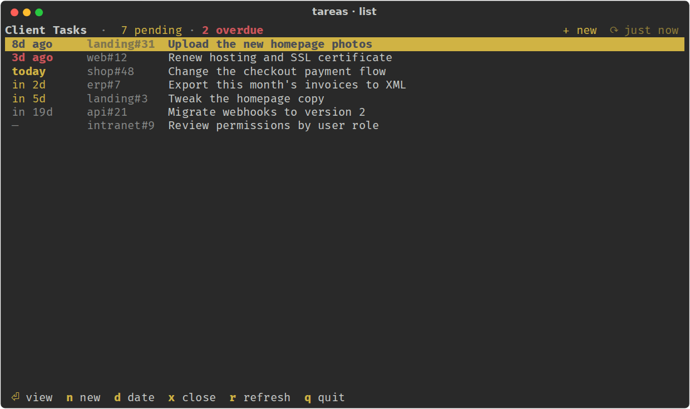
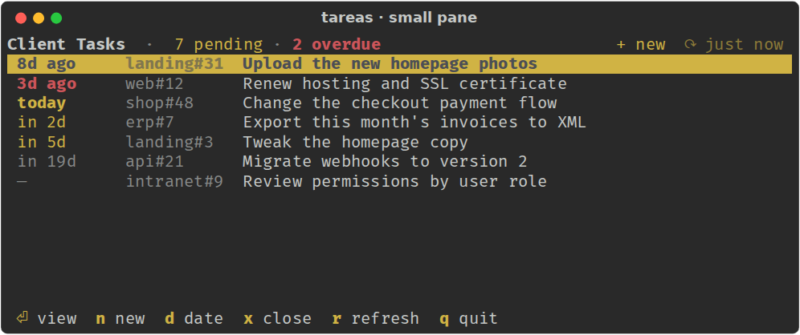
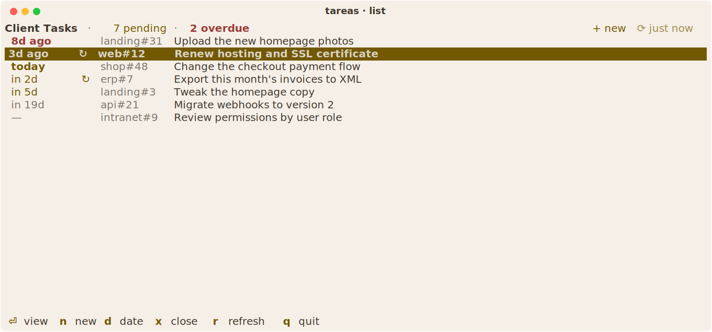
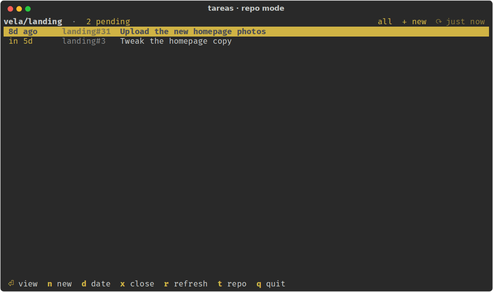
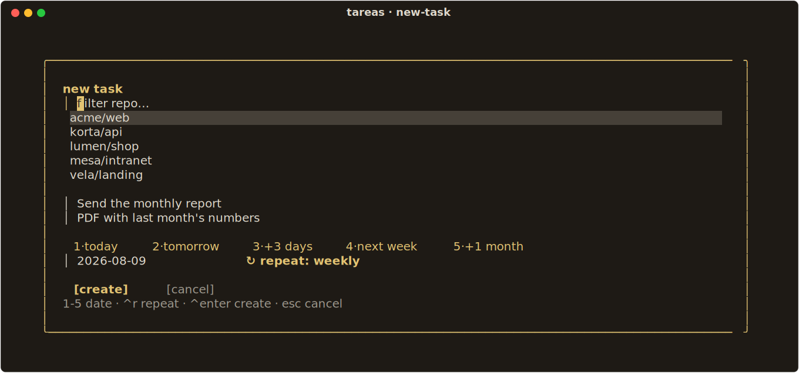
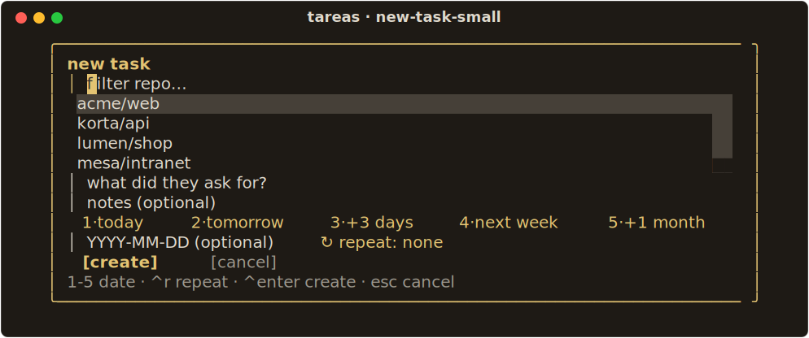
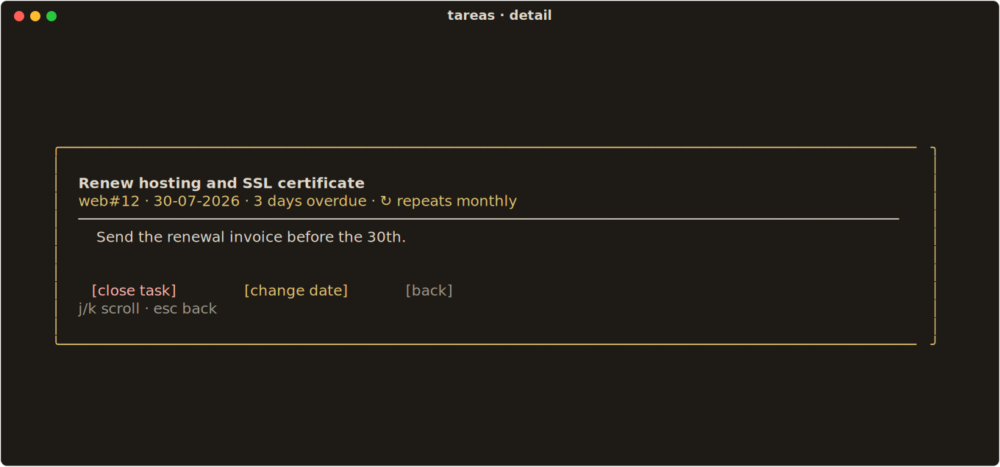
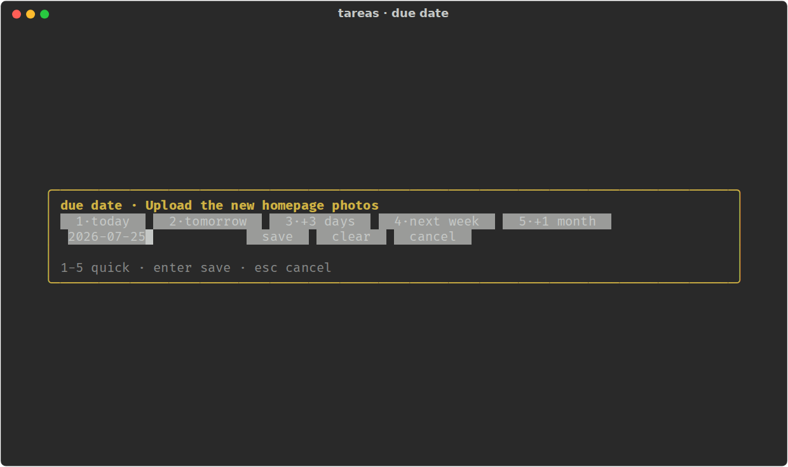
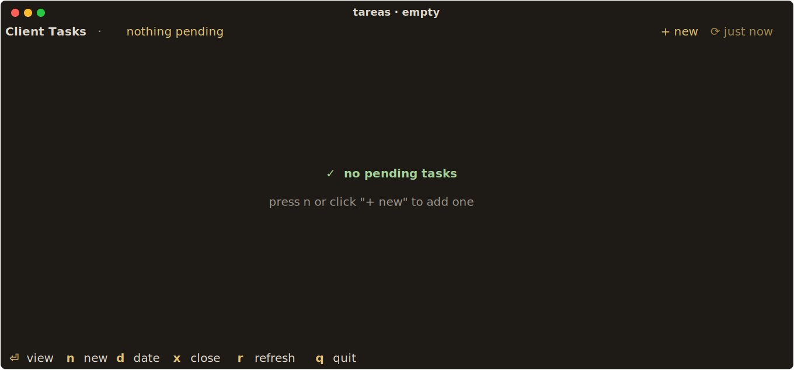

# tareas

A TUI for tracking client tasks on a **GitHub Project (v2)**, built to stay open all
day in a small pane without getting in the way.



A task is a GitHub issue inside a Project. This app is the fast view of that
Project: what's pending, what's due next, and what can be closed — without opening
a browser.

## Why it exists

GitHub's boards are comfortable full-screen and awful in a terminal pane. This is
the opposite:

- **Fits in a small pane.** The reference case is 80×15. One line per task, one
  header line, one line of shortcuts, nothing else.
- **Mouse-first.** Every action has a clickable target: rows, header buttons,
  footer shortcuts, and every button inside a dialog. The keyboard is a shortcut,
  not a requirement.
- **Responsive, in both directions.** Resizing the pane recalculates column widths
  and truncates titles with an ellipsis; and from 22 rows of screen height up, the
  dialogs stop being cramped — they gain padding and a blank line between groups.
  Below that they fall back to the compact layout. Dialogs are always as tall as
  their content, never taller.
- **Contextual repo mode.** Launch it inside a repo with a GitHub remote and the
  app starts filtered to that repo, with a toggle (`t`, or a click on
  "all"/"this repo") to switch to the full list and back.
- **Quick-pick due dates.** Set a due date with one click — today, tomorrow, +3
  days, next week, +1 month — or type an exact `YYYY-MM-DD`.
- **Recurring tasks.** Mark a task as daily, weekly, biweekly or monthly and
  closing it opens the next occurrence automatically.
- **Auto-refresh.** The list reloads itself every 5 minutes; the header shows how
  long ago it last synced. Every `gh` call gives up after 30 seconds, so a dead
  network shows an error you can retry instead of a spinner that never ends.
- **Uses your terminal's colors.** No hardcoded palette — it inherits yours, so if
  your terminal switches between light and dark, the app switches with it.

| Small pane (80×15) | Light terminal |
|---|---|
|  |  |

## Requirements

- **Python 3.11 or higher** (uses `tomllib`).
- **[GitHub CLI](https://cli.github.com), authenticated** (`gh auth login`). All
  reading and writing goes through `gh`; the app doesn't store credentials.
- A GitHub Project (v2) with a *Date*-type field for the due date.

## Installation

```bash
git clone https://github.com/Pit-CL/tareas.git ~/Projects/tareas
~/Projects/tareas/bin/tareas
```

The `bin/tareas` launcher takes care of the rest: the first run sets up an
isolated environment in `~/.venvs/tareas` with the textual version the app needs,
and from then on it just starts it. It also restarts the app if it crashes, so the
pane it lives in never ends up dead.

To have it on your `PATH`:

```bash
ln -sf ~/Projects/tareas/bin/tareas ~/.local/bin/tareas
```

It can also be installed as a package, if you'd rather manage the environment
yourself:

```bash
pipx install git+https://github.com/Pit-CL/tareas.git   # gives you the tareas-tui command
```

## Configuration

Copy [`config.example.toml`](config.example.toml) to
`~/.config/tareas/config.toml` and adjust the values:

```toml
owner = "my-user"             # owner of the Project (user or organization)
project = 1                   # the number at the end of the Project's URL
campo_fecha = "Due date"      # name of the Date-type field
estado_hecho = "Done"         # Status option that counts as done
```

If you rename the date field on GitHub without updating `campo_fecha`, the app
keeps reading it by its id — which a rename doesn't change — and says so, instead
of quietly showing every task with no due date.

No need to look up internal identifiers: the app resolves the Project's node IDs
with `gh` on first run and caches them in `~/.config/tareas/ids-cache.json`. If you
ever change the Project, delete that file and they get resolved again — that's
also when the app picks up a renamed Project title (see below).

Next to it, `~/.config/tareas/datos-cache.json` keeps the last good read (tasks,
repo list, which repo each directory belongs to, and which tasks you closed from
here) so the list is on screen from the first frame instead of after a round trip
to GitHub. It refreshes in the
background right away, and the `⟳ 3m ago` in the header always tells you how old
what you're looking at is. The file is disposable: delete it and the next start
just goes back to asking `gh` for everything.

> **Removed in 1.1.0:** the `cuerpo_nuevo` key. New issues used to be created with
> that fixed placeholder body; now the body is whatever you type in the *notes*
> field of the new-task dialog, and empty by default. If the key is still in your
> config file it's simply ignored.

## Usage

The main view is just the list, sorted by due date. Everything else is a dialog
that opens on top and closes with `esc`, a click outside, or its own button.

The header title shows the **real name of your GitHub Project** (fetched through
`gh`, not a fixed label) while you're looking at the full list; in repo mode it
shows that repo's `owner/name` instead.

**With the mouse**

| Gesture | What it does |
|---|---|
| Click a row | Selects it |
| Click the already-selected row, or double-click | Opens the detail |
| Wheel | Scrolls the list and the detail body |
| Click `+ new` / `⟳` (header) | Creates a task / reloads |
| Click a footer shortcut | Runs that action |
| Click the `↻ repeat:` chip | Cycles the recurrence |
| Click outside a dialog | Closes it |

**With the keyboard**

Every button carries its own shortcut in its label (`[x·close task]`, `[^s·save]`),
so there's nothing to memorise: whatever you can click, you can also type. `esc`
always cancels or goes back, and it's spelled out in each dialog's hint line.

| Key | Where | Action |
|---|---|---|
| `↑` `↓` (or `k` `j`) | list | Move the selection |
| `enter` | list | View the detail |
| `n` | list | New task |
| `d` | list | Change the due date |
| `x` | list | Close the task (asks for confirmation) |
| `r` | list | Reload |
| `t` | list | Toggle between "all" and "this repo" (only inside a repo) |
| `g` / `G` | list | Jump to the first / last task |
| `q` | list | Quit |
| `j` / `k` | detail | Scroll the body |
| `x` | detail | Close the task (same key as in the list) |
| `d` | detail | Change the due date |
| `1`–`5` | new task, due date | Quick-pick a due date |
| `enter` | new task | Jump to the next field |
| `ctrl+s` | new task, due date | Create / save, from any field |
| `ctrl+x` | due date | Clear the due date |
| `ctrl+r` | new task | Cycle the recurrence |
| `ctrl+p` | new task | Pick a different repo (repo mode) |
| `y` / `n` | confirmation | Confirm / cancel |
| `esc` | any dialog | Close it |

Dialogs use `ctrl+`*letter* and plain letters use themselves: inside a dialog with
a text field, Textual lets the field keep every printable character before any
binding sees it, so a bare letter would end up typed instead of firing. The detail
has no text field, which is why `x` and `d` work there exactly as in the list.

`ctrl+enter` also creates and saves, but only on terminals that speak the [kitty
keyboard protocol](https://sw.kovidgoyal.net/kitty/keyboard-protocol/) end to end
(kitty, WezTerm, Ghostty, foot… and *not* through tmux or ssh without it). It is
deliberately never advertised in the UI: everywhere else the terminal sends the
same byte for `enter` and `ctrl+enter`, so it would be a shortcut that does
nothing. `ctrl+s` always works.

The list reloads itself every 5 minutes; the header shows how long ago it last
updated. The selection follows the *task*, not the row number: when a reload
re-sorts the list — after you change a due date, say — the cursor stays on whatever
you had selected, so an immediate `x` never closes the wrong thing.

While a task is being closed or saved its row says so (`closing…` / `saving…`)
where the due date goes, and it ignores a second `x` until the first one is done —
one keystroke, one issue closed.

The app reads up to 1000 items from the Project. GitHub applies that limit *before*
the done ones are filtered out, so if you ever hit it the app says so and asks you
to archive the completed ones; a Project that never gets archived would otherwise
start hiding pending tasks with no warning.

### Contextual repo mode

If you launch `tareas` from inside a repo with a GitHub remote, the app starts
filtered to that repo: the header shows its name instead of your Project's title,
and the list only shows that repo's tasks. A click on "all" (or the `t` key)
toggles to the full list and back; outside a repo, the toggle doesn't appear.



Creating a task (`n`) in repo mode preselects that repo without opening the
repo picker — it only asks for a title, a description and a date. If you'd rather
pick a different repo, click the fixed repo label (or press `ctrl+p`) to reveal the
normal picker.

### Creating a task

The new-task dialog asks for a repo, a **title**, an optional **description** (it
becomes the issue body — leave it empty and the issue has no body), an optional due
date and an optional recurrence. `enter` walks the fields one by one; `ctrl+s`
creates from wherever you are.

Both text fields are one line tall and sit one on top of the other, so each one
says what it is right in its placeholder (`title · …`, `description · …`) and shows
a vertical bar on its left marking where you can type — accented on the field that
has the focus.

| Roomy (110×24) | Compact (80×15) |
|---|---|
|  |  |

### Recurring tasks

The `↻ repeat:` chip in the new-task dialog cycles through **none → daily →
weekly → biweekly → monthly** (click it, or press `ctrl+r`). A recurrence needs a
due date to count from: without one the task is still created, but the app tells
you the recurrence wasn't applied.

Recurring tasks show a `↻` in the list and a `↻ repeats <interval>` note in the
detail. When you close one **from the TUI** (`x`, then confirm), the app closes the
issue and immediately creates the next occurrence: same repo, title and notes, with
the due date moved one interval forward. If the task was already overdue, the new
date catches up until it lands in the future — a weekly task closed a month late
comes back next week, not already overdue. Monthly moves by calendar month and
clamps to the end of it (31 January → 28 February), always counting from the
original day, so a task due on the 31st doesn't drift backwards over time.

The recurrence lives inside the issue body as an HTML comment
(`<!-- tareas:repeat=weekly -->`), which GitHub doesn't render, so nothing extra is
needed in your Project and the notes you see are only yours.

Two limitations worth knowing:

- **Only the TUI spawns the next occurrence.** Closing the issue from GitHub, from
  `gh`, or with a `Closes #N` in a pull request just closes it — the series stops
  there.
- **The recurrence is set when the task is created.** The due-date dialog doesn't
  change it; to alter the recurrence of an existing task, edit the
  `<!-- tareas:repeat=… -->` comment in the issue body.

### Setting a due date without typing

The due date dialog has clickable shortcuts — *today*, *tomorrow*, *+3 days*,
*next week*, *+1 month* — and also accepts an exact date as `YYYY-MM-DD`. The
*clear* button removes the due date.

| Detail | Due date |
|---|---|
|  |  |

When nothing is left pending, it says so:



## Scripting: `tareas add`

`tareas add` creates a task without opening the TUI — for a script, a cron job, or
an agent that just finished a spec and wants to file it as a task. It reuses the
same GraphQL calls as the app, so a task created this way is identical to one
created from the new-task dialog.

```bash
tareas add "Renew the SSL certificate"
tareas add "Fix the checkout bug" --repo vela/landing --due 2026-09-10
```

- `--repo owner/repo` (or just `repo`, which uses the `owner` from your config).
  Without it, `tareas add` falls back to the same contextual detection as the
  TUI: the repo of the directory you're running it from; if that can't be
  resolved either, it fails and asks for `--repo`.
- `--due` accepts `YYYY-MM-DD` or `DD-MM-YYYY`. Without it the task has no due date.
- `--notes "…"` sets the issue body. For anything long or multiline — the usual
  case when an agent is filing a full spec — pass `--notes -` and pipe it in
  instead of fighting shell quoting:

```bash
tareas add "Add CSV export to the reports page" --repo iktus-erp --due 2026-08-20 --notes - <<'EOF'
## Spec

- Export button next to the date filter
- Same columns as the on-screen table
- UTF-8 with BOM (opens right in Excel)
EOF
```

On success it prints the issue reference and exits `0`:

```
created iktus-erp#431 · due 2026-08-20 · https://github.com/owner/iktus-erp/issues/431
```

On failure it prints a message to stderr and exits `2` — never anything else, so
the crash-restart loop the TUI relies on (see below) can't turn one failed
`tareas add` into a duplicate issue by retrying it.

## Colors

The app defines a theme with `ansi=True`, so its colors are your terminal's **own
ANSI 0-15 colors**: the background and text are yours, and status colors use the
semantic slots (red for overdue, yellow for due soon). That's why the screenshots
above look different from each other — it's the same code over different palettes —
and why there's nothing to configure to make it look right in light or dark.

Secondary text that you actually *read* — distant and missing due dates, the repo
column, the hints, the sync timestamp, the field placeholders, the `[cancel]`
buttons — uses **color 7**, not `dim`. `dim` is rendered by blending the text into
the background, which drops it to 2.7:1 on light and 4.0:1 on dark; color 7
measures 7.38:1 on light and 10.72:1 on dark while still sitting below normal text
(10.24:1 / 12.30:1), so the hierarchy survives and the text stays legible. `dim` is
kept only for the decorative `·` separators in the header.

The due date column is the one that earns the most from this, since it's the whole
point of the row. It reads as four steps: **overdue** (bold red) → **today** (bold
amber) → **due soon** (amber) → **far off or undated** (color 7).

The row under the cursor paints text in color 0 over color 3. Textual's
`cursor_foreground_priority` only overrides the *color* of a cell, never its
attributes, so a cell marked `dim` used to keep fading against the cursor's
background until it was unreadable. Nothing ships `dim` any more, but `TablaTareas`
still cancels it on that row so the problem can't come back in through a new cell.

## Running in a persistent pane

`bin/tareas` restarts the app on its own if it crashes (only exit codes `0`, `2`,
`130`, and `143` are treated as final; anything else triggers a restart after a
short pause), which makes it a good fit for a pane that's meant to stay alive —
tmux, another terminal multiplexer, or any pane manager that keeps a long-running
command around. Point that pane's command at `bin/tareas` (or the `tareas` symlink
on your `PATH`) and it keeps coming back on its own.

## Development

```bash
python3 -m venv .venv && .venv/bin/pip install -e ".[dev]"
TAREAS_DEMO=1 .venv/bin/python -m tareas_tui     # sample data, no GitHub calls
.venv/bin/pytest                                 # smoke test with textual's Pilot
```

`TAREAS_DEMO=1` starts the app with sample tasks and without calling `gh`. That's
what's used for this README's screenshots. `BackendDemo(repo_actual="owner/repo")`
also simulates contextual repo mode without touching GitHub.

The code is four modules: `config.py` (configuration and ID resolution),
`datos.py` (`gh` calls, date math and formatting), `cache.py` (the on-disk copy of
the last good read), and `app.py` (the interface). Tests are split the same way:
`tests/test_repeticion.py` covers the recurrence math on its own,
`tests/test_backend.py` covers the `gh` layer (timeouts, orphaned subprocesses,
partial writes, the item limit, a renamed date field) against a fake `gh`,
`tests/test_cache.py` covers the disk cache (round trip, corrupt or stale files,
and that the demo never touches it), `tests/test_arranque.py` covers the entry
point guards (no terminal, unreadable config), and `tests/test_app.py` drives the
interface with textual's Pilot. The whole
suite runs without the GitHub CLI installed and without credentials or network,
which is what CI does on Python 3.11 and 3.12 — and `tests/conftest.py` points
`XDG_CONFIG_HOME` at a temporary directory so it never reads or writes the config
of whoever runs it.

> **Note:** the interface currently ships in English; the dates and data you'll
> see when you run it come straight from your own GitHub Project.

## License

MIT — see [LICENSE](LICENSE).
